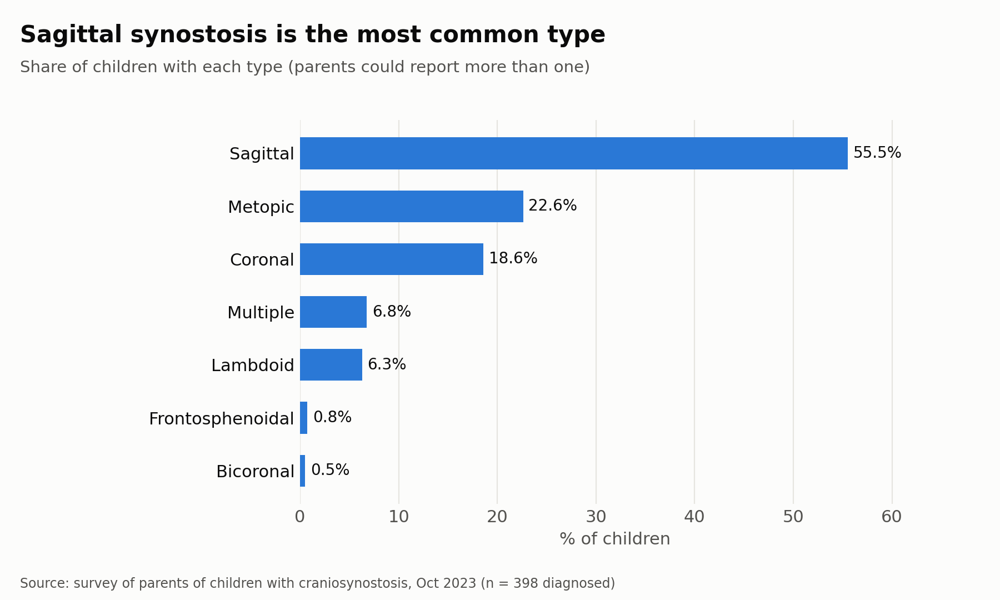
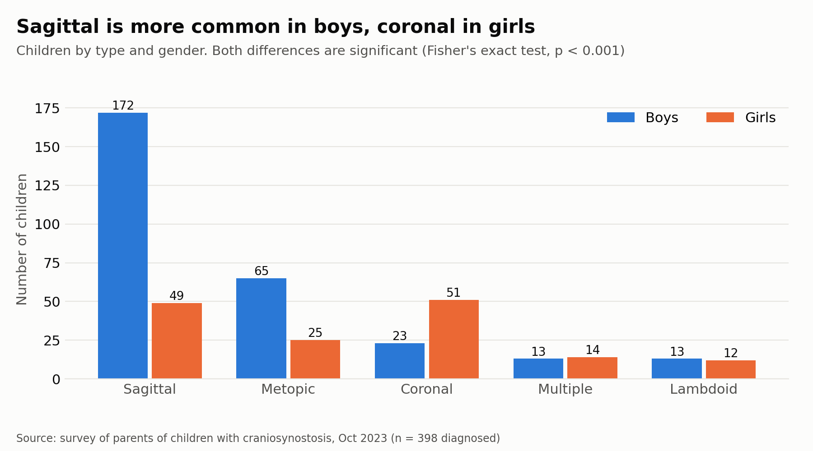
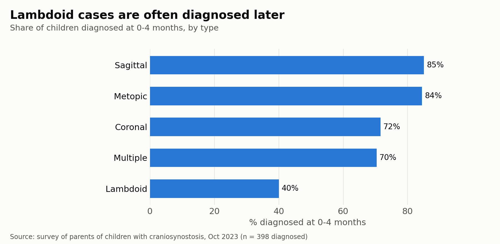
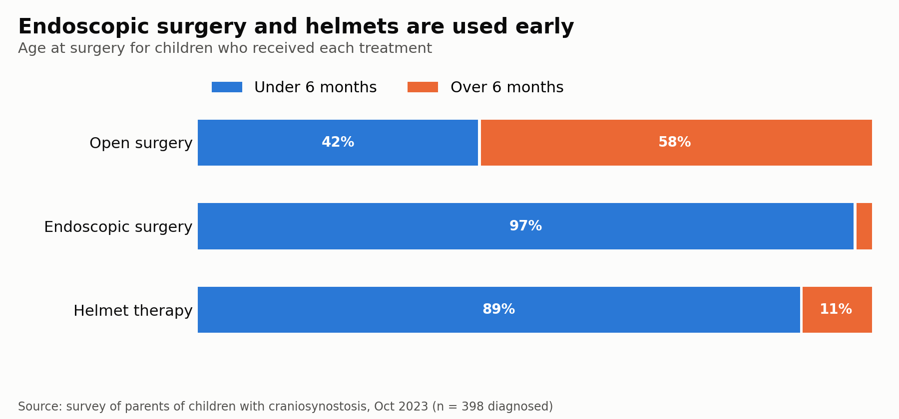

# Craniosynostosis in U.S. Infants: A Parent-Reported Survey Analysis

**Capstone project · M.S. Data Analytics, University of Houston–Downtown (Fall 2023)**

Author: Baraah Alshannaq · Advisor: Prof. Benjamin Soibam
## Overview

Craniosynostosis is a birth defect where an infant's skull bones fuse too early. It affects about 1 in 2,500 U.S. births. Most published research comes from clinical records. This project looks at the condition from the families' side: how and when children were diagnosed, which treatments they received, and how they are doing afterward.

I designed the survey, got ethics approval, collected the data, and ran the full analysis in R.

> **Update (2026):** while preparing this project for my portfolio, I reviewed my original code, found and fixed several bugs (for example, one test was run on the wrong variable), and re-ran the analysis. The results below are the corrected ones, so a few differ from my original 2023 presentation.

## Key question

Does the **type** of craniosynostosis relate to **age at diagnosis**, **gender**, **cognitive impact**, and **speech and language development**?

## Data

| | |
|---|---|
| **Source** | Original survey of parents and caregivers of infants diagnosed with craniosynostosis |
| **Collection** | Google Forms (October 2023), shared in five online support communities (Cranio Kids, Cranio Care Bears, Craniosynostosis Metopic Q&A, CAPPSKIDS.org, and others) |
| **Ethics** | Approved by the UHD Human Subjects Committee (IRB). All participants gave informed consent. |
| **Size** | 400 responses × 32 variables |
| **Variables** | Demographics (birth date, gender, race, state), diagnosis and symptoms, treatment and insurance, cognitive and speech outcomes, quality of life, satisfaction |

> **Privacy note:** The raw survey data contains health information about children and is not published in this repository. Only the analysis code and charts are shared here.

## Methods

1. **Data cleaning (R):** standardized free-text answers, recoded multi-select questions into yes/no indicator columns, grouped race and insurance answers, and handled missing values.
2. **Exploratory analysis:** distributions by type, gender, age, state, and race.
3. **Statistical testing:** Fisher's exact tests (suited to small cell counts) to test links between craniosynostosis type and gender, age at diagnosis, cognitive impact, and speech/language impact, with a Bonferroni correction for running 7 tests per question.
4. **Visualization:** charts of type distribution, diagnosis age, treatment by age group, and outcomes.

## Key findings

Results are for the 398 children diagnosed with craniosynostosis.

- **Sagittal synostosis was the most common type (55.5%)**, followed by metopic (22.6%) and coronal (18.6%). Parents could report more than one type.
- **Gender:** sagittal synostosis was much more common in boys (172 boys vs. 49 girls), while coronal synostosis was more common in girls (51 girls vs. 23 boys). Both differences were significant (p < 0.001), even after correcting for multiple tests.
- **Age at diagnosis:** 79% of children were diagnosed at **0–4 months**. Age at diagnosis differed by type for **sagittal** (diagnosed earlier, p = 0.007), **lambdoid** (diagnosed later, p < 0.001), and **multiple-suture** cases (p = 0.008).
- **Treatment:** 64% of children had open surgery, 40% had helmet therapy, and 37% had endoscopic surgery (many had more than one). Endoscopic surgery and helmet therapy were almost always done before 6 months of age, while most open surgeries (58%) were done after 6 months.
- **Outcomes:** 95% of parents reported an improved head shape. Complications were rare (about 2–3%) and similar across all treatments.
- **Development:** 23% of parents reported a cognitive impact and 26% reported a speech or language impact. No craniosynostosis type was significantly linked to either outcome.
- **Quality of life:** 79% of parents rated their child's quality of life as excellent, and **66% were very satisfied** with treatment results.

## Limitations
## Charts

- **Self-selected sample:** respondents came from online support groups, so the sample over-represents Texas and White families. Results describe this group, not national prevalence.
- **Few undiagnosed respondents:** with only 2 respondents without a diagnosis, the data cannot test whether family history is a risk factor.
- **Very small groups:** frontosphenoidal (3 children) and bicoronal (2 children) are too rare to test reliably.
- **Parent-reported outcomes:** cognitive and speech impacts are based on parents' reports, not clinical assessments.

## Future work

- Study syndromes associated with craniosynostosis
- Follow long-term recovery after surgery
- Analyze surgery costs
- Look at environmental, maternal, and prenatal factors
- Evaluate genetic testing for early detection

## Tools

**R** for cleaning, analysis, statistical testing, and visualization · **Google Forms** for data collection · **PowerPoint** for the final presentation

## Files in this repository

- `README.md`: this project summary
- `craniosynostosis_analysis.R`: data cleaning, charts, and statistical tests
- `figures/`: charts created by the script

## Contact

Baraah Alshannaq · [www.linkedin.com/in/
baraah-alshannaq-43775a111
] · baraah.shannaq89@gmail.com
